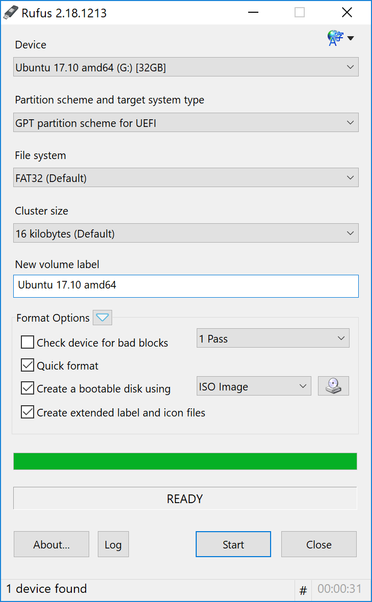
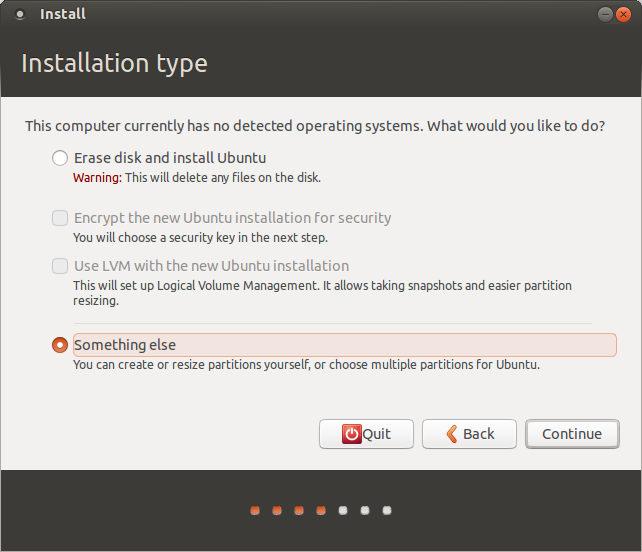
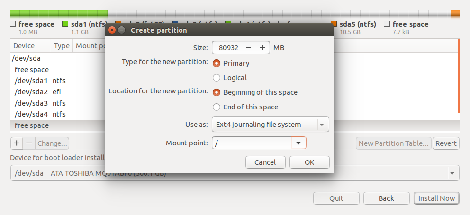

# How_to_build_DL_BOX

# Ubuntu
## Download ubuntu-16.04.4-desktop-amd64.iso  
http://releases.ubuntu.com/16.04/
## Install ISO on your own USB 
1. download [rufus](rufus-2.18p.exe)
2. setting like this:



## BIOS setup
1. `F2` to access the BIOS,
2. advanced mode, Disable Fast Boot
3. boot bootdevice: UEFI and
    boot from storage: UEFI only 
4. i. go to boot key management

   ii. mount usb
   
   iii. save secure boot key 
   
   iv. delete PK
   
   v. make sure secure boot state disabled
5. exit and save 
6. after restart, use `F2`

choose the boot UEFI your usb

choose install ubuntu
## Install Ubuntu
### if you meet black screen problem
[(in Chinese, update English version later)](ubuntu_black_screen(Chinese).md)

### partition

1. Start the installation. Proceed to Step 4 and choose "Something else": 



2. Click "New Partition Table..."

3. Select free space and click `+`

4. 500MB for EFI system partition (no need for mount point unless dual system)

5. other space for root(i.e. mount point "/") using EXT4:



6. **!IMPORTANT: **

**device for boot loader install: choose the partition you assigned for EFI system**

# GPU driver
## check your driver and download it
[for Titan Xp] http://www.nvidia.com/download/driverResults.aspx/128737/en-us

[for Quadro M6000] http://www.nvidia.com/download/driverResults.aspx/134262/en-us

## before you install Nvidia Driver
[stop X sever](stop_X_service.md)

## execute:

```bash
sudo bash filename.run
```

If pop out "The distribution-provided pre-install script failed!  Are you sure you want to continue?", ignore it and click continue.

When installation finished, run `nvidia-smi` to make sure this installation successful.


# Only Install CUDA and GPU driver in the Administrator account

**leave admin account as clean as possiblle**

CUDA version 8.0

tutorial: 

## English: https://askubuntu.com/questions/799184/how-can-i-install-cuda-on-ubuntu-16-04

Attention: If you have already installed NVIDIA driver in the previous steps, you can skip Step3 in the tutorial above and type "n" when asked if you want to install Nvidia Accelerater Driver 3xx during the installation process. 

After installation, you should add the following lines to ~/.bashrc file to change the environment variables:

```
# add cuda to environment variables
export PATH=/usr/local/cuda-8.0/bin:$PATH
export LD_LIBRARY_PATH=/usr/local/cuda-8.0/lib64:$LD_LIBRARY_PATH
export CUDA_HOME=/usr/local/cuda
```
You can type `nvcc --version` in a new terminal to verify if this installation is successful. 

## Chinese: http://www.52nlp.cn/%E4%BB%8E%E9%9B%B6%E5%BC%80%E5%A7%8B%E6%90%AD%E5%BB%BA%E6%B7%B1%E5%BA%A6%E5%AD%A6%E4%B9%A0%E6%9C%8D%E5%8A%A1%E5%99%A8%E7%8E%AF%E5%A2%83%E9%85%8D%E7%BD%AEubuntu-1080ti-cuda-cudnn


# Create your own account and install Anaconda first

## Anaconda

### download
https://www.anaconda.com/download/#linux

### Follow this link to install Anaconda:
https://docs.anaconda.com/anaconda/install/linux

Possible problem: cannot successfully create environment(PackageNotFoundError).
Solution: open terminal: `conda update conda`

## cudnn

```bash
conda install -c anaconda cudnn
```

https://anaconda.org/anaconda/cudnn

## caffe2


# optional:
[How to mount the hard drive in computer directory as data folder](mount_harddrive_as_data.md)

[How to enable ssh service](http://ubuntuhandbook.org/index.php/2016/04/enable-ssh-ubuntu-16-04-lts/)

[set up permission to each user](link)

[ubuntu system error configuration](http://www.rodsbooks.com/linux-uefi/#preparing)
